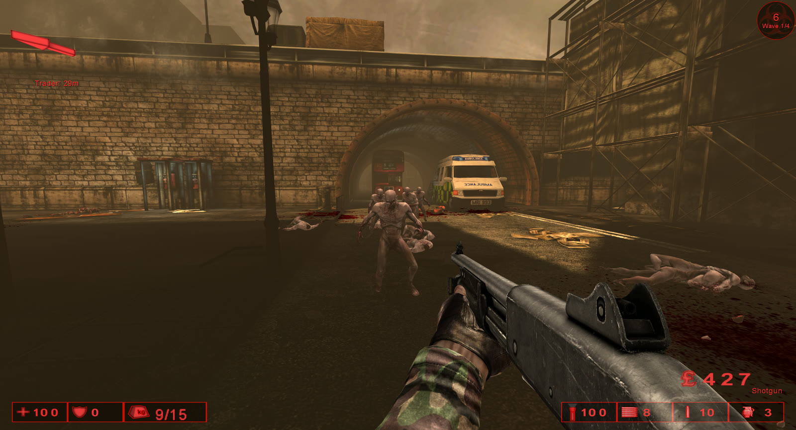

# Open KF

A from-scratch Rust + Bevy reimplementation of Killing Floor (2009), reading the
original game's files from an installed copy. It currently supports
single-player only. No game assets are included in this repository.



*KF-WestLondon in Open KF: wave 1, shotgun in hand, the trader 29 m away.*

See `docs/DESIGN.md` for how it works and the plan.

## Requirements

- An installed copy of Killing Floor (Steam). Found automatically at
  `references/killing_floor` or the usual Steam folders. Set `KF_ROOT` to
  override. **This will not work if you don't have the original game assets**
- Nix with flakes. `direnv allow` or `nix develop` gives you Rust and the system
  libraries Bevy needs. The flake files must be tracked by git (`git add flake.nix
  flake.lock`) or Nix will not see them.

## Running the map viewer

```sh
cargo run --release                        # opens KF-WestLondon
cargo run --release -- --map KF-Offices    # any map name from the game's Maps folder
cargo run --release -- --frames 300        # quits by itself after 300 frames (for test runs)
cargo run --release -- --fly --camera -4090,1300,-3650,-1.5708,0 --screenshot 60   # start at a saved view, screenshot, quit
cargo run --release -- --fly               # start flying (the map viewer); V switches between flying and walking
cargo run --release -- --autowalk 4        # walk test: hold forward for 4 s (see logs/latest.log "walk" lines)
cargo run --release -- --fly --input 120:fire,200:1 --screenshot 126,330   # scripted input + screenshots (tests)
cargo run --release -- --zed        # a Clot spawns in front of you and comes at you
cargo run --release -- --gorefast   # the same with a Gorefast
cargo run --release -- --spawn fleshpound   # any specimen: clot, gorefast, crawler, stalker, bloat, siren, husk, scrake, fleshpound, patriarch
cargo run --release -- --spawn patriarch --god --input 300:record,600:record   # test: record a 5 s video (scripted F9)
cargo run --release -- --spawn clot --god   # god mode: zeds hit you (logged) but you lose no health
cargo run --release -- --zed --always-sever   # test: killing shots on limbs always sever them
cargo run --release -- --give all             # test: carry every base-game weapon (or --give AK47AssaultRifle,Shotgun)
cargo run --release -- --input 200:sound:KF_9MMSnd.9mm_Fire,300:sound_at:KF_9MMSnd.9mm_Fire@600   # test: play a sound at you, then 600 units to your right
cargo run --release -- --input 200:jump   # test action: jump (also "jump" in any --input list)
scripts/headless.sh --fly --camera -4090,1300,-3650,-1.5708,0 --screenshot 60   # the same, on a virtual display: no window opens
cargo run --release -- --no-vsync --frames 600   # test runs: frames do not wait for the display (a hidden window ran at 1 fps)
cargo run --release -- --mute                 # no sound (still logged)
cargo run --release -- --fps 30               # cap the frame rate (vsync still caps it at the monitor's refresh rate)
cargo run --release -- --zed --zed-at -4512,-230,-3816   # test: the zed starts at a map position (Unreal X,Y,Z)
```

Saved views for checking the viewer are listed in `docs/test-views.md`.

| Control | Action |
| --- | --- |
| Left click | capture the mouse (needed to look around) |
| Escape | release the mouse |
| Mouse | look |
| W A S D | move |
| Space or E / Ctrl or Q | up / down |
| Shift | move 4x faster |
| F12 | screenshot to `work/screenshots/`, with a `.txt` command that recreates the view |
| F9 | start / stop recording a video to `work/videos/` (30 fps, H.264, up to 1280 wide); the window title shows `[REC]` |
| V | switch between flying and walking |
| 1 2 3 4 5 | weapon slots: melee, pistols, primary, specials, equipment; press again to cycle within a slot (KF's rules) |
| Mouse wheel | next / previous weapon |
| Left click (mouse captured) | fire |
| Middle click (mouse captured) | alt fire (KF's key): melee heavy attacks; full / semi auto switch on rifles (HUD shows [AUTO] / [SEMI]) |
| Right click (mouse captured) | iron sights on / off; on the Crossbow and M99 the 3D scope |
| R | reload |
| Z | spawn a zed in front of you (more spawn side by side); the HUD shows which |
| N | change what Z spawns (all ten specimens) |
| G | throw a frag grenade (HUD: FRAGS) |
| Q | quick heal: bring out the Syringe, inject, switch back (HUD: SYRINGE %) |
| H | spawn a Gorefast in front of you |
| X | pause / resume zeds |
| F1 | god mode on / off (the debug line shows "(GOD)") |
| F2 | zed time now (debug) |
| F3 | show / hide the debug line at the top |
| Space (walking) | jump |

Each run writes `logs/latest.log`: what was loaded (counts, load time), camera
position once per second (Bevy metres and Unreal units), frame timings, and
exit status.

Package inspection tool:

```sh
cargo run --release -p ue-assets --bin kfpkg -- scan                       # parse every package
cargo run --release -p ue-assets --bin kfpkg -- info Maps/KF-Farm.rom      # objects by class
cargo run --release -p ue-assets --bin kfpkg -- exports Maps/KF-Farm.rom Light
cargo run --release -p ue-assets --bin kfpkg -- props Maps/KF-Farm.rom Light # writes work/props/KF-Farm-Light.txt
cargo run --release -p ue-assets --bin kfpkg -- scanprops                  # read properties of every object
cargo run --release -p ue-assets --bin kfpkg -- scripts                    # UnrealScript source -> work/scripts/
cargo run --release -p ue-assets --bin kfpkg -- textures                   # decode every texture (checks)
cargo run --release -p ue-assets --bin kfpkg -- texture Textures/KillingFloorTextures.utx House2SkinNEW  # -> work/textures/*.png
cargo run --release -p ue-assets --bin kfpkg -- meshes                     # decode every static mesh (checks)
cargo run --release -p ue-assets --bin kfpkg -- level KF-Farm              # load a map like the viewer, report counts
cargo run --release -p ue-assets --bin kfpkg -- bspmaterials KF-WestLondon # per-material BSP report -> logs/
cargo run --release -p ue-assets --bin kfpkg -- zones KF-WestLondon [25]   # BSP zones; with a number, that zone's polygons
cargo run --release -p ue-assets --bin kfpkg -- terrain KF-Farm [X,Y]      # terrain layers, height check; ground height at X,Y
```

## License

Dual-licensed under MIT (`LICENSE-MIT`) or Apache 2.0 (`LICENSE-APACHE`), at your
option. This covers the source code only, not Killing Floor's game files.
